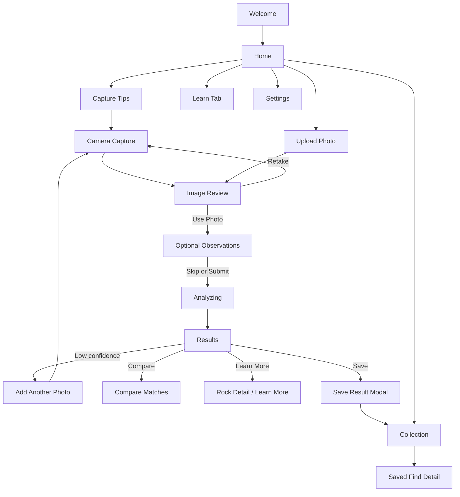

**Clickable Flow Map**

## **Lo-Fi UX Spec**

### **Navigation**

- Primary nav is a 4-tab bottom bar: `Identify`, `Collection`, `Learn`, `Settings`.
- The default landing tab for returning users is `Identify`.
- The main action on `Identify` is always visible above the fold: `Take Photo`.

### **Screen 1: Welcome**

Goal:
Introduce the value, reduce intimidation, and set trust expectations.

Content:

- Logo / app name
- One-line promise
- 3 short benefit cards
- Educational disclaimer
- `Get Started`
- `Browse Sample Rocks`

Primary action:

- `Get Started`

Exit paths:

- Continue to permission intro
- Browse examples without account

**Screen 2: Permission Intro**
Goal:
Explain why camera and optional location are requested.

Content:

- Short camera explanation
- Optional location explanation
- Privacy reassurance
- `Continue`
- `Not Now`

Rules:

- Camera permission should be requested before first capture attempt.
- Location should not be requested at onboarding unless product strategy explicitly wants geo-aware identification.

**Screen 3: Home / Identify**
Goal:
Get user into scan flow fast.

Content:

- Hero CTA: `Take Photo`
- Secondary CTA: `Upload Photo`
- Link: `How to photograph a rock`
- Recent finds preview
- Bottom nav

Rules:

- No clutter above the main CTA.
- Recent items should be hidden if empty and replaced with a simple onboarding empty state.

**Screen 4: Capture Tips**
Goal:
Increase usable image quality before camera opens.

Content:

- 4-item checklist
- Example photo
- `Open Camera`

Rules:

- Skippable after first use
- Should be available again from help/tips

**Screen 5: Camera Capture**
Goal:
Capture a sharp, usable rock image.

Content:

- Live camera
- Framing guide
- Flash control
- Gallery shortcut
- Capture button
- Prompt text
- Optional scale hint

Rules:

- The app should surface live hints like `Move closer`, `Hold steady`, `Need more light`.
- Rear camera default.
- No heavy UI chrome blocking the specimen.

### **Screen 6: Image Review**

Goal:
Confirm the selected image is good enough to analyze.

Content:

- Large preview
- Quality checklist
- Warning tips if needed
- `Retake`
- `Use Photo`

Rules:

- If image fails quality threshold badly, show stronger warning but still permit override.
- Quality factors should be human-readable, not technical.

### **Screen 7: Optional Observations**

Goal:
Collect structured evidence that a photo cannot reliably infer.

Content:

- Fast tap chips for color, grain size, layering, banding, vesicles, visible crystals, glassy look
- Optional notes field
- Optional location toggle
- `Analyze Rock`
- `Skip`

Rules:

- Entire screen must be optional.
- Inputs should take under 15 seconds for most users.

### **Screen 8: Analyzing**

Goal:
Communicate progress and reassure the user.

Content:

- Thumbnail
- Loader
- Short copy about what is being analyzed

Rules:

- If analysis exceeds 3 seconds, add rotating educational microcopy.
- If the network fails, show retry state instead of spinner lock.

**Screen 9: Results**
Goal:
Present likely IDs, confidence, reasoning, and next actions.

Content:

- Top match card
- Confidence badge
- Category label
- Why this match
- Top 3 alternatives
- Look-alikes
- Suggested next check
- `Save`
- `Retake`
- `Compare`
- `Learn More`

Rules:

- Confidence must be visible before the user scrolls.
- Never show a single answer without alternatives when confidence is low or medium.
- The explanation should be plain-language, not just model features.

### **Screen 10: Low-Confidence Results Variant**

Goal:
Handle ambiguity honestly and guide next steps.

Content:

- Strong low-confidence banner
- 3 closest matches
- Recommended next evidence
- `Add Another Photo`
- `Add Field Notes`

Rules:

- This screen should feel helpful, not like an error.
- It should explicitly say that many rocks need more than one photo.

### **Screen 11: Compare Matches**

Goal:
Help the user distinguish similar possibilities.

Content:

- Side-by-side candidate cards
- Shared traits
- Distinguishing traits
- What to check next

Rules:

- Keep comparison to 2 or 3 candidates max.
- Use field-observable traits only.

### **Screen 12: Learn More**

Goal:
Turn the result into a mini geology lesson.

Content:

- Name
- Rock type
- Plain-language description
- Formation environment
- Look-alikes
- Quick field tip

Rules:

- Avoid overly academic terminology unless paired with simple explanations.

### **Screen 13: Save Result Modal**
Goal:
Let the user store the find quickly.

Content:

- Thumbnail
- Editable title
- Date
- Optional location
- Notes
- `Save to Collection`

Rules:

- Default title should be generated from top match + date.
- Saving should not require account creation in MVP unless business model requires it.

### **Screen 14: Collection**

Goal:
Browse, search, and filter saved finds.

Content:

- Search bar
- Filter chips
- Saved cards
- Empty state for first-time users

Rules:

- Cards show thumbnail, top match, date, confidence.
- Empty state should push users back to `Identify`.

### **Screen 15: Saved Find Detail**

Goal:
Review a saved item in full context.

Content:

- Image
- Saved identification
- Notes
- Location if enabled
- `Re-analyze`

Rules:

- Re-analysis should preserve previous result history if the product wants auditability.

### **Screen 16: Learn Tab**

Goal:
Offer evergreen educational value beyond identification.

Content:

- Topic cards
- Search
- Basic geology guides

Rules:

- Should be shallow and beginner-friendly in MVP.

### **Screen 17: Settings**

Goal:
Manage permissions, privacy, and preferences.

Content:

- Camera permission
- Location permission
- Storage choices
- Privacy
- Feedback
- Version info

Rules:

- Privacy and data handling need prominent clarity because photos may include location-sensitive field finds.

### **Developer-Ready Requirements**

### **Global**

- iOS and Android responsive layouts
- Bottom nav persistent on main tabs only
- Loading, empty, error, and offline states for every primary flow
- Accessibility labels for all buttons and image-quality warnings
- Confidence must not rely on color alone

### **Camera Flow**

- Support capture and library import
- Run image-quality checks before analysis
- Allow retake loop without losing session state

### **Analysis Flow**

- Accept one required image and optional structured metadata
- Return top 3 matches minimum
- Return confidence band and reasoning summary
- Return follow-up recommendation when confidence is not high

### **Save Flow**

- Save photo reference, result payload, timestamp, notes, and optional location
- Permit offline viewing of saved records

### **Edge Cases**

- Permission denied
- No network
- Non-rock object
- Very low confidence
- Poor image
- Model timeout

### **Recommended Next Deliverable**

The strongest next artifact is a screen-by-screen requirements doc with:

- fields
- states
- button labels
- validation rules
- API inputs/outputs

### **MVP Scope Note**

This flow map reflects the MVP navigation and primary user paths. Future flow expansions such as richer comparison, multi-photo analysis, account-linked history, expert review, and classroom features are sequenced in [Roadmap.md](<Roadmap.md>).
