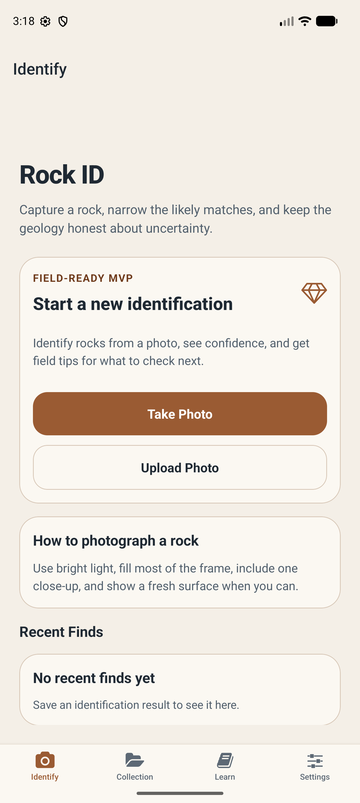
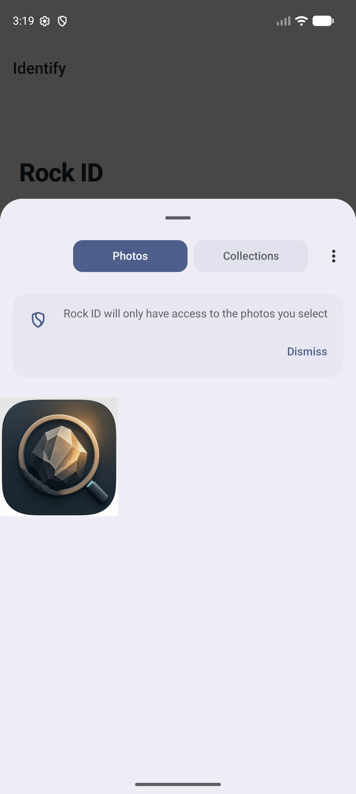
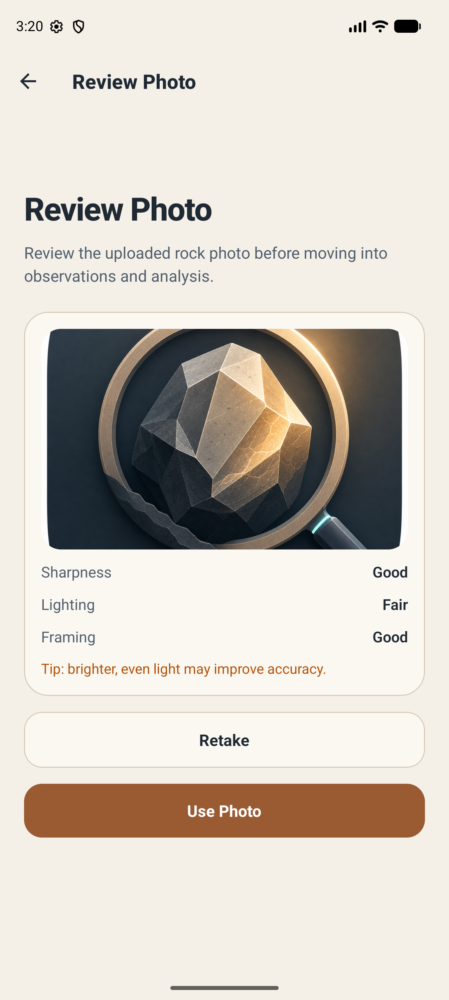
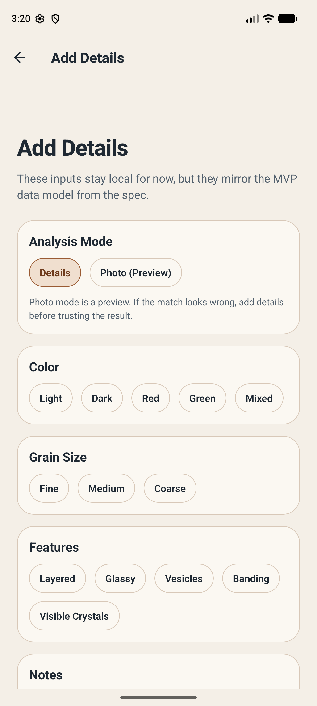
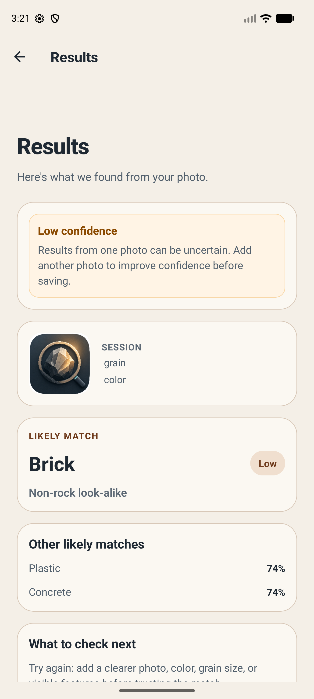
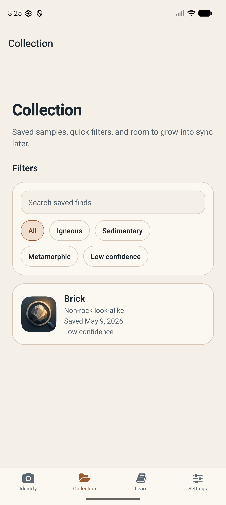
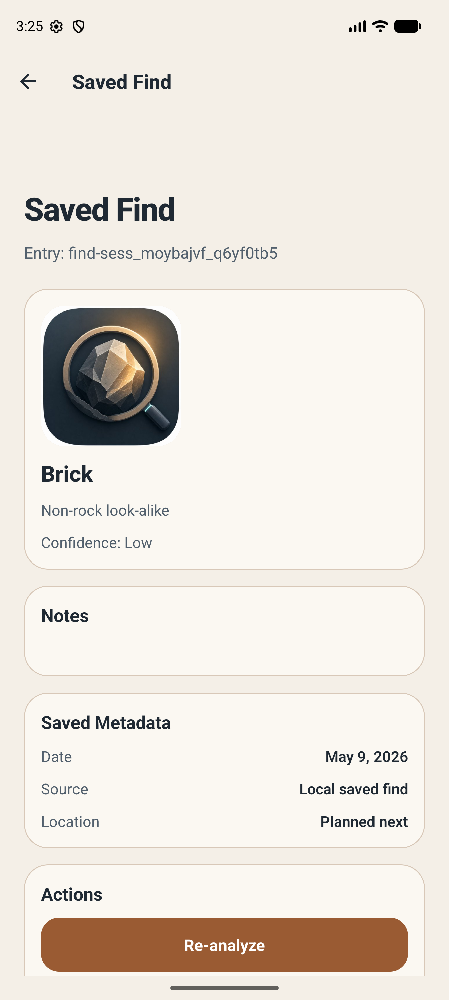

# Android Preview Smoke Reproduction

Date: May 9, 2026

Purpose: reproduce the Friends Beta Wave 1 Android preview smoke test and preserve the screenshot evidence for the install, offline scan, save/reopen, and reanalyze path.

## Environment

- Platform: Android emulator
- Device observed: `emulator-5554`
- Package: `com.anonymous.rockid`
- Build source: EAS Android preview APK
- Test image source: `assets/images/icon.png`, pushed to emulator Downloads as `rockid-smoke-test.png`

## Signature Mismatch Fix

The first EAS APK install failed with:

```text
INSTALL_FAILED_UPDATE_INCOMPATIBLE: Existing package com.anonymous.rockid signatures do not match newer version
```

This means the emulator already had a local build installed with a different signing key. For emulator/local beta validation, uninstall the old package and install the preview APK again:

```sh
adb uninstall com.anonymous.rockid
adb install /path/to/eas-preview.apk
```

Do not use this as a user-facing upgrade path. It is a local testing cleanup step for differently signed builds.

## Reproduction Steps

1. Start or attach an Android emulator.
2. Install the EAS preview APK.
3. Launch Rock ID.
4. Push a test image into the emulator photo library:

```sh
adb push assets/images/icon.png /sdcard/Download/rockid-smoke-test.png
adb shell am broadcast -a android.intent.action.MEDIA_SCANNER_SCAN_FILE -d file:///sdcard/Download/rockid-smoke-test.png
```

5. Tap `Upload Photo`.
6. Select the pushed image in Android Photo Picker.
7. Confirm the Review Photo screen loads with image quality hints.
8. Tap `Use Photo`.
9. Add or skip details until `Analyze Rock` is available.
10. Tap `Analyze Rock`.
11. Confirm the Results screen renders low-confidence copy and alternatives.
12. Tap `Save Result`.
13. Open Collection and confirm the saved result appears.
14. Open the saved result detail.
15. Tap `Re-analyze` and confirm the app returns to Review Photo with the saved image.

## Expected Result

- App launches without crash.
- Android Photo Picker opens and returns the selected image.
- Review Photo, Add Details, Analyze Rock, and Results screens complete without crash.
- Low-confidence copy is visible and understandable.
- Save Result persists the finding into Collection.
- Saved Find detail opens from Collection.
- Re-analyze returns to Review Photo with the saved image.

## Screenshot Evidence

### 1. App Launch



### 2. Android Photo Picker



### 3. Review Photo



### 4. Add Details



### 5. Low-Confidence Results



### 6. Collection Saved Result



### 7. Saved Find Detail



### 8. Re-analyze Review Photo


## Notes For Beta Triage

- If a tester sees the signature mismatch error, ask whether they previously installed a local/dev build.
- For trusted friends, a clean uninstall/reinstall is acceptable for Wave 1 preview testing because local data may be disposable.
- For broader beta distribution, avoid changing package signing lineage between builds.
